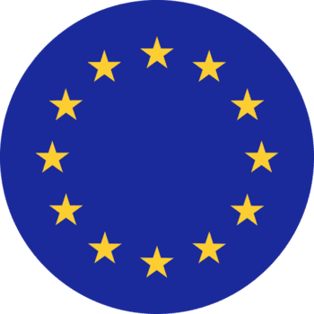

  
  

# INTELLIGENT Project — Energy Web AG (EWAG) Repository

> EU Horizon Project | Grant Agreement No. 101160678 | Work Package 3 (Lead: EWAG)

This repository is maintained by **Energy Web AG (EWAG)** as the lead beneficiary of **WP3 — Data Integration and Interoperability Infrastructure** in the INTELLIGENT project. It serves as the central documentation and artefact store for EWAG's technical contributions, including the common data ontology, JSON Schema definitions, Energy Web Digital Spine customizations, and deployment materials. It is termed **INTELLIGENT EWDS 2.0** and published under GNU GPL v3 License.

## About the INTELLIGENT Project
 
INTELLIGENT is an EU-funded Horizon Europe project (Grant No. 101160678) developing critical, cutting-edge technology to equip citizens organised in energy communities and their grid operators to deploy peer-to-peer (P2P) energy trading at scale.
 
The project builds on Grid Singularity's open-source P2P platform (GSY DEX), expanding its capabilities to support advanced trading mechanisms such as multi-attribute auctions, while connecting spot and flexibility markets. The **Energy Web Digital Spine (EWDS)** serves as the secure, interoperable data exchange middleware underpinning all platform services.

Four pilot sites demonstrate the platform in real-world conditions:
 
| Pilot | Location | Partner |
|-------|----------|---------|
| Pilot 1 | Living Lab, Switzerland (CELL) | HSLU |
| Pilot 2 | Lugaggia Innovation Community (LIC), Switzerland | AEM |
| Pilot 3 | Greenvolt Comunidades, Portugal | GV / ERE |
| Pilot 4 | Inis Mór, Aran Islands, Ireland | UG / CFA |

## Repository Purpose
 
This repository documents and version-controls EWAG's technical deliverables and related artefacts. Specifically, it contains:
 
1. **Ontology documentation** — the final, versioned common ontology developed for the INTELLIGENT platform, covering all entity classes, attributes, validation rules, and standard mappings.
2. **JSON Schema definitions** — machine-readable schemas derived from the ontology, used for data validation and interoperability across services.
3. **Energy Web Digital Spine customizations** — system architecture, integration patterns, and API specifications for INTELLIGENT EWDS 2.0.
4. **Deployment manuals** — step-by-step guides for deploying and configuring EWDS, Energy Web Green Proofs, and Energy Web OCN 2.0 components.
5. **Supporting documents** — working materials such as the Entity Relationship (ER) diagram, ontology mapping references, and task tracking references.

## Connect with Energy Web
- [Twitter](https://twitter.com/energywebx)
- [Discord](https://discord.com/channels/706103009205288990/843970822254362664)
- [Telegram](https://t.me/energyweb)

## Acknowledgement

<table>
  <tr>
    <td valign="middle" width="100">
      
    </td>
    <td valign="middle">
      This work is carried out in the context of the INTELLIGENT project, funded by the European Union under the Horizon Europe programme (Grant Agreement No. 101160678). Views and opinions expressed are those of the authors only and do not necessarily reflect those of the European Union or CINEA. Neither the European Union nor the granting authority can be held responsible for them.
    </td>
  </tr>
  <tr>
    <td valign="middle" align="center" colspan="2">
      
    </td>
  </tr>
</table>

## License

This project is licensed under the GNU General Public License v3.0 or later - see the [LICENSE](LICENSE) file for details

