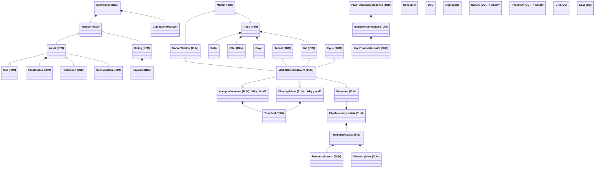

```mermaid
classDiagram
  Community *-- Member
  Community *-- CommunityManager

  Member o-- Asset
  Member o-- Billing

  Asset --o Site
  Asset *-- AssetStatus
  Asset o-- Production
  Asset o-- Consumption

  Market o-- Trade
  Market o-- MarketWindow

  Trade *-- Seller
  Trade *-- Offer
  Trade *-- Buyer
  Trade *-- Bid

  Billing *-- Payment

  AcceptedVolumes *-- TimeGrid
  ClearingPrices *-- TimeGrid

  MarketOutcomeEvent --o AcceptedVolumes
  MarketOutcomeEvent --o ClearingPrices
  MarketOutcomeEvent --o Prosumer

  MarketWindow o-- MarketOutcomeEvent

  Tenant o-- MarketOutcomeEvent
  Bid o-- MarketOutcomeEvent
  Cycle o-- MarketOutcomeEvent

  Prosumer --* PilotTelemetryUpdate
  PilotTelemetryUpdate *-- TelemetryPayload
  TelemetryPayload *-- TelemetryPowers
  TelemetryPayload *-- TelemetryState

  InputTimeseriesResponse *-- InputTimeseriesItem
  InputTimeseriesItem *-- InputTimeseriesPoint

  %% Actors
  class Member ["Member (R2M)"] {}
  class Tenant ["Tenant (TUM)"] {}
  class Prosumer ["Prosumer (TUM)"] {}
  class Consumer {}
  class DSO {}
  class Aggregator {}
  class Buyer {}
  class Seller {}
  class CommunityManager {}

  class Community ["Community (R2M)"] {}
  class Site ["Site (R2M)"] {}
  class Asset ["Asset (R2M)"] {}
  class AssetStatus ["AssetStatus (R2M)"] {}
  class Bid ["Bid (R2M)"] {}
  class Offer ["Offer (R2M)"] {}
  class Market ["Market (R2M)"] {}
  class Trade ["Trade (R2M)"] {}
  class Production ["Production (R2M)"] {}
  class Consumption ["Consumption (R2M)"] {}
  class Billing ["Billing (R2M)"] {}
  class Payment ["Payment (R2M)"] {}
  class TimeGrid ["TimeGrid (TUM)"] {}
  class MarketWindow ["MarketWindow (TUM)"] {}
  class AcceptedVolumes ["AcceptedVolumes (TUM) : Why plural?"] {}
  class ClearingPrices ["ClearingPrices (TUM) : Why plural?"] {}
  class Cycle ["Cycle (TUM)"] {}
  class MarketOutcomeEvent ["MarketOutcomeEvent (TUM)"] {}
  class InputTimeseriesPoint ["InputTimeseriesPoint (TUM)"] {}
  class InputTimeseriesItem ["InputTimeseriesItem (TUM)"] {}
  class InputTimeseriesResponse ["InputTimeseriesResponse (TUM)"] {}
  class TelemetryState ["TelemetryState (TUM)"] {}
  class TelemetryPowers ["TelemetryPowers (TUM)"] {}
  class TelemetryPayload ["TelemetryPayload (TUM)"] {}
  class PilotTelemetryUpdate ["PilotTelemetryUpdate (TUM)"] {}
  class Battery ["Battery (UG) --> Asset?"] {}
  class PvSystem ["PvSystem (UG) --> Asset?"] {}
  class Grid ["Grid (UG)"] {}
  class Load ["Load (UG)"] {}
```
