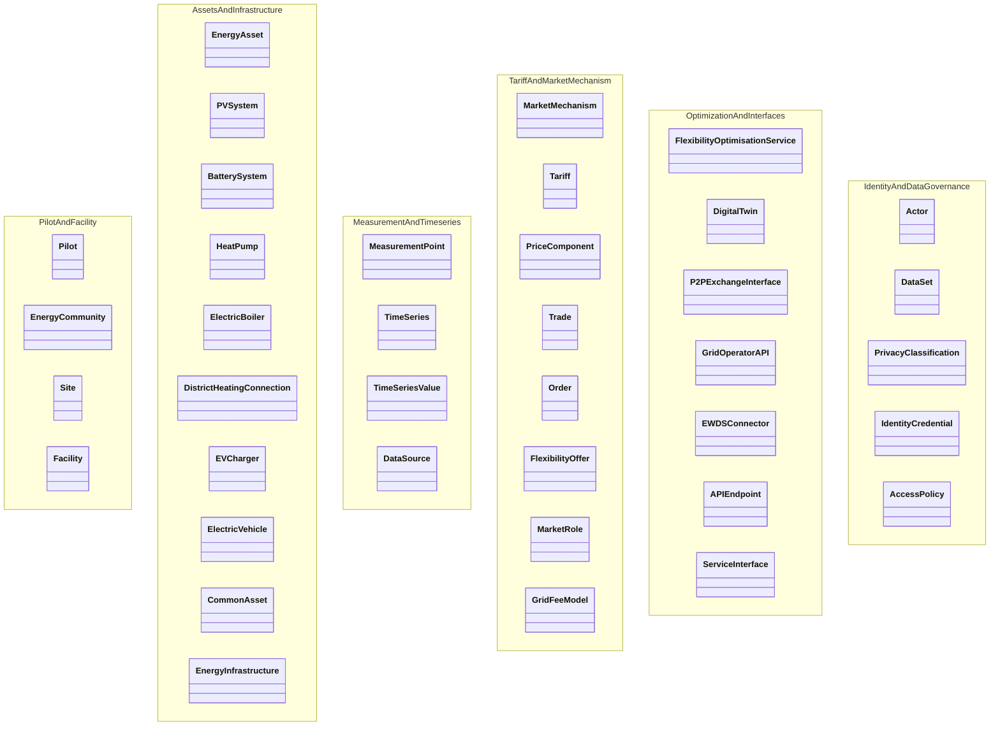

```mermaid
classDiagram
    namespace PilotAndFacility {
        class Pilot {}
        class EnergyCommunity {}
        class Site {}
        class Facility {}
    }
    namespace AssetsAndInfrastructure {
        class EnergyAsset {}
        class PVSystem {}
        class BatterySystem {}
        class HeatPump {}
        class ElectricBoiler {}
        class DistrictHeatingConnection {}
        class EVCharger {}
        class ElectricVehicle {}
        class CommonAsset {}
        class EnergyInfrastructure {}
    }
    namespace MeasurementAndTimeseries {
        class MeasurementPoint {}
        class TimeSeries {}
        class TimeSeriesValue {}
        class DataSource {}
    }
    namespace TariffAndMarketMechanism {
        class MarketMechanism {}
        class Tariff {}
        class PriceComponent {}
        class Trade {}
        class Order {}
        class FlexibilityOffer {}
        class MarketRole {}
        class GridFeeModel {}
    }
    namespace OptimizationAndInterfaces {
        class FlexibilityOptimisationService {}
        class DigitalTwin {}
        class P2PExchangeInterface {}
        class GridOperatorAPI {}
        class EWDSConnector {}
        class APIEndpoint {}
        class ServiceInterface {}
    }
    namespace IdentityAndDataGovernance {
        class Actor {}
        class DataSet {}
        class PrivacyClassification {}
        class IdentityCredential {}
        class AccessPolicy {}
    }
```
