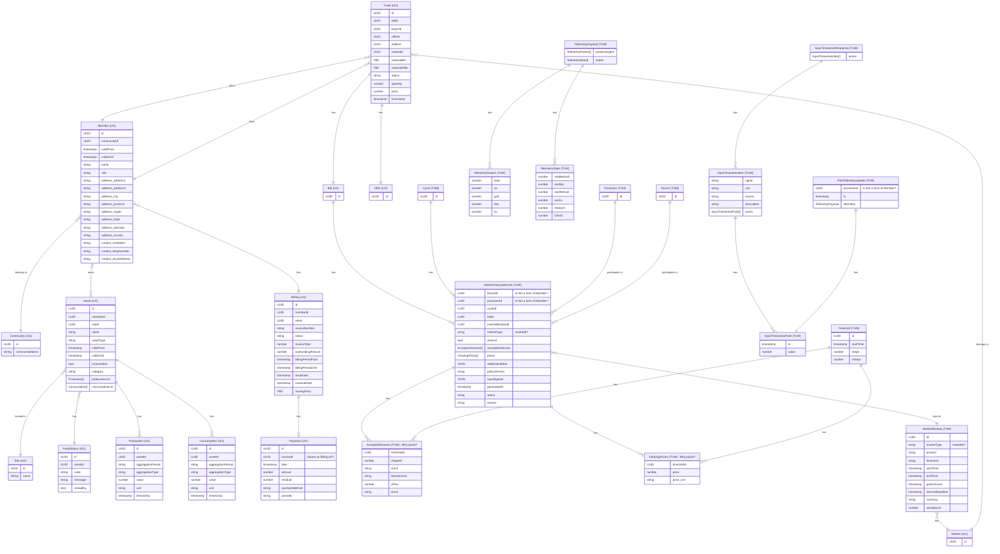

```mermaid

%%{init: { 
  "theme": "default", 
  "themeCSS": [
    "[id^=entity-Member] .er.entityBox { fill: #F88379; }",
    "[id^=entity-Community] .er.entityBox { fill: #F88379; }"
    "[id^=entity-Asset] .er.entityBox { fill: #F88379; }"
    "[id^=entity-Site] .er.entityBox { fill: #F88379; }"
    "[id^=entity-AssetStatus] .er.entityBox { fill: #F88379; }"
    "[id^=entity-Production] .er.entityBox { fill: #F88379; }"
    "[id^=entity-Consumption] .er.entityBox { fill: #F88379; }"
    "[id^=entity-Trade] .er.entityBox { fill: #F88379; }"
    "[id^=entity-Bid] .er.entityBox { fill: #F88379; }"
    "[id^=entity-Offer] .er.entityBox { fill: #F88379; }"
    "[id^=entity-Market] .er.entityBox { fill: #F88379; }"
    "[id^=entity-Billing] .er.entityBox { fill: #F88379; }"
  ] 
}}%%

erDiagram
  Member }o--|| Community : "belongs to"
  Member |o--o{ Asset : "owns"
  Member }o--|| Billing : "has"
  Asset }o--|| Site : "located in"
  Asset }o--|| AssetStatus : "has"
  Asset ||--o{ Production: "has"
  Asset ||--o{ Consumption: "has"
  Trade ||--|| Bid : "has"
  Trade ||--|| Offer : "has"
  Trade }o--|| Market : "belongs to"
  Trade }o--|| Member : "buys"
  Trade }o--|| Member : "offers"
  Billing ||--o| Payment : "has"
  TimeGrid ||--o{ AcceptedVolumes : "has"
  TimeGrid ||--o{ ClearingPrices : "has"
  PilotTelemetryUpdate ||--|| InputTimeseriesPoint : "has"
  TelemetryPayload ||--o{ TelemetryPowers : "has"
  TelemetryPayload ||--o{ TelemetryState : "has"
  InputTimeseriesResponse ||--o{ InputTimeseriesItem : "has"
  InputTimeseriesItem ||--o{ InputTimeseriesPoint : "has"
  MarketWindow }o--|| Market : "has"
  Tenant ||--o{ MarketOutcomeEvent : "participates in"
  Prosumer ||--o{ MarketOutcomeEvent : "participates in"
  Cycle ||--o{ MarketOutcomeEvent : "has"
  Bid ||--o{ MarketOutcomeEvent : "has"
  MarketOutcomeEvent }o--|| MarketWindow : "logs for"
  MarketOutcomeEvent ||--o{ AcceptedVolumes : "has"
  MarketOutcomeEvent ||--o{ ClearingPrices : "has"

  Community ["Community (UG)"] {
    UUID id
    String communityName
  }
  Site ["Site (UG)"] {
    UUID id
    String name
  }
  Member ["Member (UG)"] {
    UUID id
    UUID communityId
    timestamp validFrom
    timestamp validUntil
    string name
    string role
    string address_address1
    string address_address2
    string address_city
    string address_province
    string address_region
    string address_state
    string address_zipCode
    string address_country
    string contact_mobileNo
    string contact_telephoneNo
    string contact_emailAddress
  }
  Asset ["Asset (UG)"] {
    UUID id
    UUID memberId
    UUID siteId
    string name
    string assetType
    timestamp validFrom
    timestamp validUntil
    bool isControlled
    string category
    Production[] productionList
    Consumption[] consumptionList
  }
  AssetStatus ["AssetStatus (UG)"] {
    UUID id
    UUID assetId
    string code
    string message
    bool isHealthy
  }
  Bid ["Bid (UG)"] {
    UUID id
  }
  Offer ["Offer (UG)"] {
    UUID id
  }
  Market ["Market (UG)"] {
    UUID id
  }
  Trade ["Trade (UG)"] {
    UUID id
    UUID bidId
    UUID buyerId
    UUID offerId
    UUID sellerId
    UUID marketId
    TBD residualBid
    TBD residualOffer
    string status
    number quantity
    number price
    timestamp timestamp
  }
  Production ["Production (UG)"] {
    UUID id
    UUID assetId
    string aggregationPeriod
    string aggregationType
    number value
    string unit
    timestamp timestamp
  }
  Consumption ["Consumption (UG)"] {
    UUID id
    UUID assetId
    string aggregationPeriod
    string aggregationType
    number value
    string unit
    timestamp timestamp
  }
  Billing ["Billing (UG)"] {
    UUID id
    UUID memberId
    UUID siteId
    string invoiceNumber
    string status
    number invoiceTotal
    number outstandingAmount
    timestamp billingPeriodFrom
    timestamp billingPeriodUntil
    timestamp issueDate
    timestamp overdueDate
    TBD issuingParty
  }
  Payment ["Payment (UG)"] {
    UUID id
    UUID invoiceId "(Same as Billing.id?)"
    timestamp date
    number amount
    number residual
    string paymentMethod
    string provider
  }
  TimeGrid ["TimeGrid (TUM)"] {
    UUID id
    timestamp startTime
    number stepS
    number nSteps
  }
  MarketWindow ["MarketWindow (TUM)"] {
    UUID id
    string marketType "marketId?"
    string product
    string timezone
    timestamp startTime
    timestamp endTime
    timestamp gateClosure
    timestamp internalDeadline
    string currency
    number resolutionS
  }
  AcceptedVolumes ["AcceptedVolumes (TUM) : Why plural?"] {
    UUID timeGridId
    number eSigned
    string eUnit
    string flexDirection
    number pFlex
    string pUnit
  }
  ClearingPrices ["ClearingPrices (TUM) : Why plural?"] {
    UUID timeGridId
    number price
    string price_unit
  }
  Cycle ["Cycle (TUM)"] {
    UUID id
  }
  Tenant ["Tenant (TUM)"] {
    UUID id
  }
  Prosumer ["Prosumer (TUM)"] {
    UUID id
  }
  MarketOutcomeEvent ["MarketOutcomeEvent (TUM)"] {
    UUID tenantId "Is this a form of Member?"
    UUID prosumerId "Is this a form of Member?"
    UUID cycleId
    UUID bidId
    UUID marketWindowId
    string marketType "marketId?"
    bool cleared
    AcceptedVolumes[] acceptedVolumes
    ClearingPrices[] prices
    JSON settlementMeta
    string policyVersion
    JSON inputDigests
    timestamp generatedAt
    string status
    string reason
  }
  InputTimeseriesPoint ["InputTimeseriesPoint (TUM)"] {
    timestamp ts
    number value
  }
  InputTimeseriesItem ["InputTimeseriesItem (TUM)"] {
    string signal
    string unit
    string source
    string description
    InputTimeseriesPoint[] points
  }
  InputTimeseriesResponse ["InputTimeseriesResponse (TUM)"] {
    InputTimeseriesItem[] series
  }
  TelemetryState ["TelemetryState (TUM)"] {
    number soeBesKwh
    number socBes
    number soeWvKwh
    number socEv
    number tIndoorC
    number tDhwC
  }
  TelemetryPowers ["TelemetryPowers (TUM)"] {
    number load
    number pv
    number grid
    number bes
    number ev
  }
  TelemetryPayload ["TelemetryPayload (TUM)"] {
    TelemetryPowers[] powersAvgKw
    TelemetryState[] states
  }
  PilotTelemetryUpdate ["PilotTelemetryUpdate (TUM)"] {
    UUID prosumerId "Is this a form of Member?"
    timestamp ts
    TelemetryPayload telemetry
  }
```
