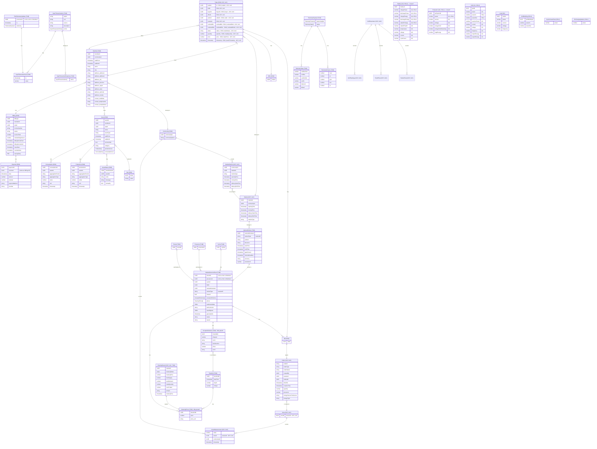

```mermaid

%%{init: { 
  "theme": "default", 
  "themeCSS": [
    "[id^=entity-Member] .er.entityBox { fill: #F88379; }",
    "[id^=entity-Community] .er.entityBox { fill: #F88379; }"
    "[id^=entity-Asset] .er.entityBox { fill: #F88379; }"
    "[id^=entity-Site] .er.entityBox { fill: #F88379; }"
    "[id^=entity-AssetStatus] .er.entityBox { fill: #F88379; }"
    "[id^=entity-Production] .er.entityBox { fill: #F88379; }"
    "[id^=entity-Consumption] .er.entityBox { fill: #F88379; }"
    "[id^=entity-Trade] .er.entityBox { fill: #F88379; }"
    "[id^=entity-Bid] .er.entityBox { fill: #F88379; }"
    "[id^=entity-Offer] .er.entityBox { fill: #F88379; }"
    "[id^=entity-Market] .er.entityBox { fill: #F88379; }"
    "[id^=entity-Billing] .er.entityBox { fill: #F88379; }"
  ] 
}}%%

erDiagram
  Member }o--|| Community : "belongs to"
  Member |o--o{ Asset : "owns"
  Member }o--|| Billing : "has"
  Asset }o--|| Site : "located in"
  Asset }o--|| AssetStatus : "has"
  Asset ||--o{ Production: "has"
  Asset ||--o{ Consumption: "has"
  Trade ||--|| Bid : "has"
  Trade ||--|| Offer : "has"
  Trade }o--|| Market : "belongs to"
  Trade }o--|| Member : "buys"
  Trade }o--|| Member : "offers"
  Bid ||--|| Order : "equals"
  Area ||--o{ AssetMeasurement : "records"
  Order }o--|| Area : "is located in"
  Community ||--o{ MarketSlotInfo : "records"
  Community ||--o{ AssetMeasurement : "records"
  MarketSlotInfo }o--|| Market : "is recorded in"
  Billing ||--o| Payment : "has"
  TimeGrid ||--o{ ClearingPrices : "has"
  Market ||--o{ MarketWindow : "belongs to"
  Tenant ||--o{ MarketOutcomeEvent : "participates in"
  Prosumer ||--o{ MarketOutcomeEvent : "participates in"
  Cycle ||--o{ MarketOutcomeEvent : "has"
  MarketOutcomeEvent ||--o{ Bid : "has"
  MarketWindow ||--|{ MarketOutcomeEvent : "results to"
  MarketOutcomeEvent ||--o{ AcceptedVolumes : "has"
  MarketOutcomeEvent ||--o{ ClearingPrices : "has"
  AcceptedVolumes }o--|| TimeGrid : "is recorded in"
  ClearingResult ||--|| ClearingPrices : "equals?"

  PilotTelemetryUpdate ||--|| InputTimeseriesPoint : "has"
  TelemetryPayload ||--o{ TelemetryPowers : "has"
  TelemetryPayload ||--o{ TelemetryState : "has"
  InputTimeseriesItem ||--o{ InputTimeseriesResponse : "belongs to"
  InputTimeseriesItem ||--o{ InputTimeseriesPoint : "has"

  GridParameter ||--o{ FeederPara : "records"
  GridParameter ||--o{ TransfPara : "records"
  GridParameter ||--o{ GridTopology : "records"

  Community ["Community (R2M)"] {
    UUID communityId
    String communityName
  }
  Site ["Site (R2M)"] {
    UUID siteId
    String name
  }
  Member ["Member (R2M)"] {
    UUID memberId
    UUID communityId
    timestamp validFrom
    timestamp validUntil
    string name
    string role
    string address_address1
    string address_address2
    string address_city
    string address_province
    string address_region
    string address_state
    string address_zipCode
    string address_country
    string contact_mobileNo
    string contact_telephoneNo
    string contact_emailAddress
  }
  Asset ["Asset (R2M)"] {
    UUID assetId
    UUID memberId
    UUID siteId
    string name
    string assetType
    timestamp validFrom
    timestamp validUntil
    bool isControlled
    string category
    Production[] productionList
    Consumption[] consumptionList
  }
  AssetStatus ["AssetStatus (R2M)"] {
    UUID assetStatusId
    UUID assetId
    string code
    string message
    bool isHealthy
  }
  Bid ["Bid (R2M)"] {
    UUID bidId
  }
  Offer ["Offer (R2M)"] {
    UUID offerId
  }
  Market ["Market (GSY, UoC)"] {
    UUID marketId
    UUID communityId
    timestamp openingTime
    timestamp closingTime
    timestamp deliveryStartTime
    timestamp deliveryEndTime
    string marketType
  }
  Trade ["Trade (R2M, GSY, UoC)"] {
    UUID tradeId "id - R2M | tradeId - GSY, UoC"
    UUID bidId "R2M, GSY, UoC"
    UUID buyerId "buyerId - R2M | buyer - GSY, UoC"
    UUID offerId "R2M, GSY, UoC"
    UUID sellerId "sellerId - R2M | seller - GSY, UoC"
    UUID marketId "R2M, GSY, UoC"
    UUID residualBid "residualBid - R2M | residualBidId - GSY, UoC"
    UUID residualOffer "residualOffer - R2M | residualOfferId - GSY, UoC"
    string status "status - R2M | tradeStatus - GSY, UoC"
    number quantity "quantity - R2M | tradeQuantity - GSY, UoC"
    number price "price - R2M | tradePrice - GSY, UoC"
    timestamp timestamp "timestamp - R2M | tradeTimestamp - GSY, UoC"
  }
  Production ["Production (R2M)"] {
    UUID productionId
    UUID assetId
    string aggregationPeriod
    string aggregationType
    number value
    string unit
    timestamp timestamp
  }
  Consumption ["Consumption (R2M)"] {
    UUID consumptionId
    UUID assetId
    string aggregationPeriod
    string aggregationType
    number value
    string unit
    timestamp timestamp
  }
  Billing ["Billing (R2M)"] {
    UUID billingId
    UUID memberId
    UUID siteId
    string invoiceNumber
    string status
    number invoiceTotal
    number outstandingAmount
    timestamp billingPeriodFrom
    timestamp billingPeriodUntil
    timestamp issueDate
    timestamp overdueDate
    TBD issuingParty
  }
  Payment ["Payment (R2M)"] {
    UUID paymentId
    UUID invoiceId "(Same as Billing.id?)"
    timestamp date
    number amount
    number residual
    string paymentMethod
    string provider
  }
  TimeGrid ["TimeGrid (TUM)"] {
    UUID timeGridId
    timestamp startTime
    number stepS
    number nSteps
  }
  MarketWindow ["MarketWindow (TUM)"] {
    UUID marketWindowId
    string marketType "marketId?"
    string product
    string timezone
    timestamp startTime
    timestamp endTime
    timestamp gateClosure
    timestamp internalDeadline
    string currency
    number resolutionS
  }
  AcceptedVolumes ["AcceptedVolumes (TUM) : Why plural?"] {
    UUID timeGridId
    number eSigned
    string eUnit
    string flexDirection
    number pFlex
    string pUnit
  }
  ClearingPrices ["ClearingPrices (TUM) : Why plural?"] {
    UUID timeGridId
    number price
    string price_unit
  }
  Cycle ["Cycle (TUM)"] {
    UUID cycleId
  }
  Tenant ["Tenant (TUM)"] {
    UUID tenantId
  }
  Prosumer ["Prosumer (TUM)"] {
    UUID prosumerId
  }
  MarketOutcomeEvent ["MarketOutcomeEvent (TUM)"] {
    UUID tenantId "Is this a form of Member?"
    UUID prosumerId "Is this a form of Member?"
    UUID cycleId
    UUID bidId
    UUID marketWindowId
    string marketType "marketId?"
    bool cleared
    AcceptedVolumes[] acceptedVolumes
    ClearingPrices[] prices
    JSON settlementMeta
    string policyVersion
    JSON inputDigests
    timestamp generatedAt
    string status
    string reason
  }
  InputTimeseriesPoint ["InputTimeseriesPoint (TUM)"] {
    timestamp ts
    number value
  }
  InputTimeseriesItem ["InputTimeseriesItem (TUM)"] {
    string signal
    string unit
    string source
    string description
    InputTimeseriesPoint[] points
  }
  InputTimeseriesResponse ["InputTimeseriesResponse (TUM)"] {
    InputTimeseriesItem[] series
  }
  TelemetryState ["TelemetryState (TUM)"] {
    number soeBesKwh
    number socBes
    number soeWvKwh
    number socEv
    number tIndoorC
    number tDhwC
  }
  TelemetryPowers ["TelemetryPowers (TUM)"] {
    number load
    number pv
    number grid
    number bes
    number ev
  }
  TelemetryPayload ["TelemetryPayload (TUM)"] {
    TelemetryPowers[] powersAvgKw
    TelemetryState[] states
  }
  PilotTelemetryUpdate ["PilotTelemetryUpdate (TUM)"] {
    UUID prosumerId "Is this a form of Member?"
    timestamp ts
    TelemetryPayload telemetry
  }
  Battery ["Battery (UG, HSLU) --> Asset?"] {
    UUID batteryId
    number chargePower "UG, HSLU"
    number dischargePower "UG, HSLU"
    number chargeEnergy "UG, HSLU"
    number dischargeEnergy "UG, HSLU"
    number stateOfCharge "UG, HSLU"
    number stateOfHealth "UG"
    number temperature "UG"
    number voltage "UG"
    number current "UG"
    number cycleCount "UG"
  }
  PvSystem ["PvSystem (UG, HSLU) --> Asset?"] {
    UUID pvSystemId
    number power "UG, HSLU"
    number current "UG"
    number voltage "UG"
    number energyYield "UG"
    number energyYieldYesterday "UG"
    number mppEnergy "UG"
  }
  Grid ["Grid (UG, HSLU)"] {
    UUID gridId
    number power "UG"
    number powerIn "HSLU"
    number powerOut "HSLU"
    number reactivePower "UG"
    number current "UG"
    number voltage "UG"
    number frequency "UG"
    number importEnergy "UG"
    number exportEnergy "UG"
  }
  Load ["Load (UG)"] {
    UUID loadId
    number power
    number current
    number voltage
    number frequency
  }
  GridBuilding ["GridBuilding (HSLU)"] {
    UUID gridBuildingId
    number powerIn
    number powerOut
  }
  HydroPowerPlant ["HydroPowerPlant (HSLU)"] {
    number power
  }
  EVChargingStation ["EVChargingStation (HSLU)"] {
    number power
  }
  Order ["Order (GSY, UoC)"] {
    string orderId
    string orderType
    string orderStatus
    UUID createdBy
    UUID areaUuid
    UUID marketId
    timestamp timeSlot
    timestamp creationTime
    number quantity
    number priceLimit
    string energySourcePreference
    string energyType
  }
  ClearingResult ["ClearingResult (GSY, UoC, TUM)"]  {
    UUID marketId
    status clearingStatus
    number clearingPrice
    number totalSupply
    number totalDemand
    number tradeQuantity
    number numTrades
    string txHash
    timestamp clearingTime
  }
  Area ["Area (GSY, UoC)"] {
    UUID areaId "areaUuid - GSY, UoC"
  }
  AssetMeasurement ["AssetMeasurement (GSY, UoC)"] {
    number value
    UUID areaId "areaUuid - GSY, UoC"
    UUID communityId
    timestamp timestamp
  }
  MarketSlotInfo ["MarketSlotInfo (GSY, UoC)"] {
    UUID communityId
    UUID marketId
    string marketType
    timestamp openingTime
    timestamp closingTime
    timestamp deliveryStartTime
    timestamp deliveryEndTime
  }
  GridParameter ["GridParameter (GSY, UoC)"] {

  }
  FeederPara ["FeederPara (GSY, UoC)"] {

  }
  TransfPara ["TransfPara (GSY, UoC)"] {

  }
  GridTopology ["GridTopology (GSY, UoC)"] {

  }
  
```
