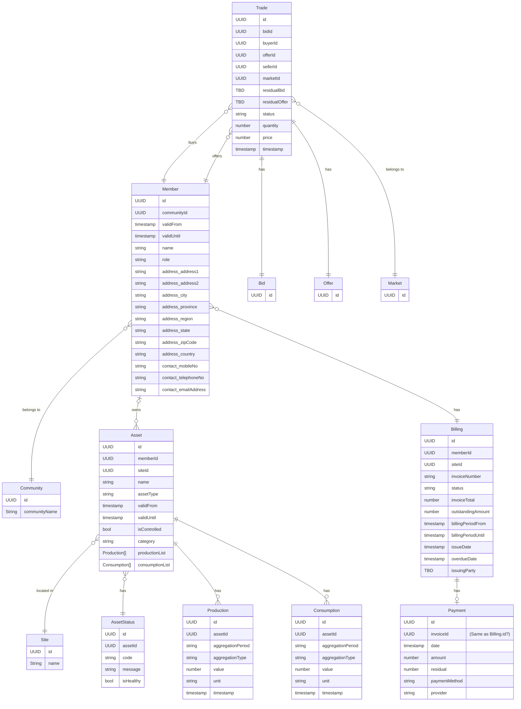

```mermaid
erDiagram
  Member }o--|| Community : "belongs to"
  Member |o--o{ Asset : "owns"
  Member }o--|| Billing : "has"
  Asset }o--|| Site : "located in"
  Asset }o--|| AssetStatus : "has"
  Asset ||--o{ Production: "has"
  Asset ||--o{ Consumption: "has"
  Trade ||--|| Bid : "has"
  Trade ||--|| Offer : "has"
  Trade }o--|| Market : "belongs to"
  Trade }o--|| Member : "buys"
  Trade }o--|| Member : "offers"
  Billing ||--o| Payment : "has"

  Community {
    UUID id
    String communityName
  }
  Site {
    UUID id
    String name
  }
  Member {
    UUID id
    UUID communityId
    timestamp validFrom
    timestamp validUntil
    string name
    string role
    string address_address1
    string address_address2
    string address_city
    string address_province
    string address_region
    string address_state
    string address_zipCode
    string address_country
    string contact_mobileNo
    string contact_telephoneNo
    string contact_emailAddress
  }
  Asset {
    UUID id
    UUID memberId
    UUID siteId
    string name
    string assetType
    timestamp validFrom
    timestamp validUntil
    bool isControlled
    string category
    Production[] productionList
    Consumption[] consumptionList
  }
  AssetStatus {
    UUID id
    UUID assetId
    string code
    string message
    bool isHealthy
  }
  Bid {
    UUID id
  }
  Offer {
    UUID id
  }
  Market {
    UUID id
  }
  Trade {
    UUID id
    UUID bidId
    UUID buyerId
    UUID offerId
    UUID sellerId
    UUID marketId
    TBD residualBid
    TBD residualOffer
    string status
    number quantity
    number price
    timestamp timestamp
  }
  Production {
    UUID id
    UUID assetId
    string aggregationPeriod
    string aggregationType
    number value
    string unit
    timestamp timestamp
  }
  Consumption {
    UUID id
    UUID assetId
    string aggregationPeriod
    string aggregationType
    number value
    string unit
    timestamp timestamp
  }
  Billing {
    UUID id
    UUID memberId
    UUID siteId
    string invoiceNumber
    string status
    number invoiceTotal
    number outstandingAmount
    timestamp billingPeriodFrom
    timestamp billingPeriodUntil
    timestamp issueDate
    timestamp overdueDate
    TBD issuingParty
  }
  Payment {
    UUID id
    UUID invoiceId "(Same as Billing.id?)"
    timestamp date
    number amount
    number residual
    string paymentMethod
    string provider
  }
```
