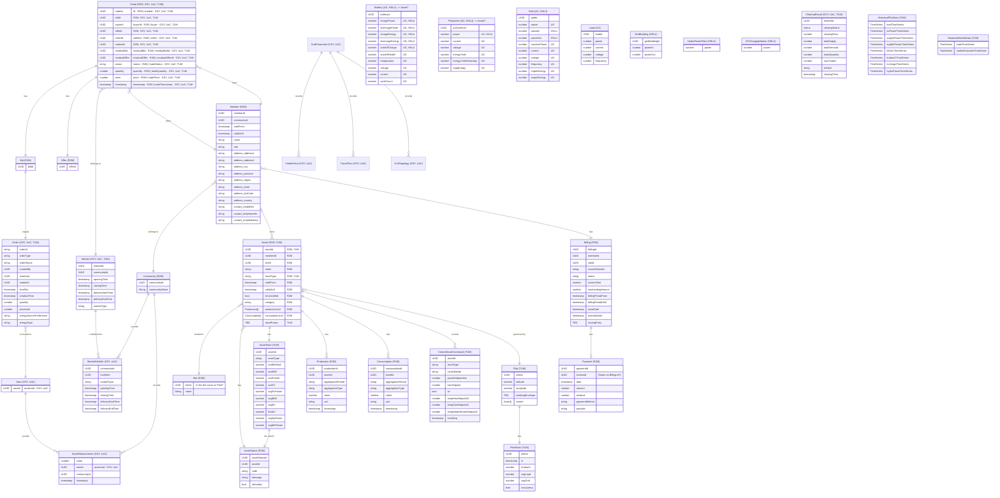

```mermaid

%%{init: { 
  "theme": "default", 
  "themeCSS": [
    "[id^=entity-Member] .er.entityBox { fill: #F88379; }",
    "[id^=entity-Community] .er.entityBox { fill: #F88379; }"
    "[id^=entity-Asset] .er.entityBox { fill: #F88379; }"
    "[id^=entity-Site] .er.entityBox { fill: #F88379; }"
    "[id^=entity-AssetStatus] .er.entityBox { fill: #F88379; }"
    "[id^=entity-Production] .er.entityBox { fill: #F88379; }"
    "[id^=entity-Consumption] .er.entityBox { fill: #F88379; }"
    "[id^=entity-Trade] .er.entityBox { fill: #F88379; }"
    "[id^=entity-Bid] .er.entityBox { fill: #F88379; }"
    "[id^=entity-Offer] .er.entityBox { fill: #F88379; }"
    "[id^=entity-Market] .er.entityBox { fill: #F88379; }"
    "[id^=entity-Billing] .er.entityBox { fill: #F88379; }"
  ] 
}}%%

erDiagram
  Member }o--|| Community : "belongs to"
  Member |o--o{ Asset : "owns"
  Member }o--|| Billing : "has"
  Asset }o--|| Site : "located in"
  Asset }o--|| AssetStatus : "has"
  Asset ||--|| AssetState : "has"
  Asset ||--o{ Production : "has"
  Asset ||--o{ Consumption : "has"
  Asset ||--o{ ControlAssetCommand : "records"
  Trade ||--|| Bid : "has"
  Trade ||--|| Offer : "has"
  Trade }o--|| Market : "belongs to"
  Trade }o--|| Member : "offers"
  Trade }o--|| Member : "buys"
  Bid ||--|| Order : "equals"
  Area ||--o{ AssetMeasurement : "records"
  Order }o--|| Area : "is located in"
  Community ||--o{ MarketSlotInfo : "records"
  Community ||--o{ AssetMeasurement : "records"
  Market ||--o{ MarketSlotInfo : "is divided into"
  Billing ||--o| Payment : "has"

  Pilot ||--|| PilotState : "has"
  Asset }o--|| Pilot : "governed by"
  AssetState ||--|| AssetStatus : "the same?"

  GridParameter ||--o{ FeederPara : "records"
  GridParameter ||--o{ TransfPara : "records"
  GridParameter ||--o{ GridTopology : "records"

  Community ["Community (R2M)"] {
    UUID communityId
    String communityName
  }
  Site ["Site (R2M)"] {
    UUID siteId "Is this the same as Pilot?"
    String name
  }
  Member ["Member (R2M)"] {
    UUID memberId
    UUID communityId
    timestamp validFrom
    timestamp validUntil
    string name
    string role
    string address_address1
    string address_address2
    string address_city
    string address_province
    string address_region
    string address_state
    string address_zipCode
    string address_country
    string contact_mobileNo
    string contact_telephoneNo
    string contact_emailAddress
  }
  Asset ["Asset (R2M, TUM)"] {
    UUID assetId "R2M, TUM"
    UUID memberId "R2M"
    UUID siteId "R2M"
    string name "R2M"
    string assetType "R2M, TUM"
    timestamp validFrom "R2M"
    timestamp validUntil "R2M"
    bool isControlled "R2M"
    string category "R2M"
    Production[] productionList "R2M"
    Consumption[] consumptionList "R2M"
    TBD assetParam "TUM"
  }
  AssetStatus ["AssetStatus (R2M)"] {
    UUID assetStatusId
    UUID assetId
    string code
    string message
    bool isHealthy
  }
  Bid ["Bid (R2M)"] {
    UUID bidId
  }
  Offer ["Offer (R2M)"] {
    UUID offerId
  }
  Market ["Market (GSY, UoC, TUM)"] {
    UUID marketId
    UUID communityId
    timestamp openingTime
    timestamp closingTime
    timestamp deliveryStartTime
    timestamp deliveryEndTime
    string marketType
  }
  Trade ["Trade (R2M, GSY, UoC, TUM)"] {
    UUID tradeId "id - R2M | tradeId - GSY, UoC, TUM"
    UUID bidId "R2M, GSY, UoC, TUM"
    UUID buyerId "buyerId - R2M | buyer - GSY, UoC, TUM"
    UUID offerId "R2M, GSY, UoC, TUM"
    UUID sellerId "sellerId - R2M | seller - GSY, UoC, TUM"
    UUID marketId "R2M, GSY, UoC, TUM"
    UUID residualBid "residualBid - R2M | residualBidId - GSY, UoC, TUM"
    UUID residualOffer "residualOffer - R2M | residualOfferId - GSY, UoC, TUM"
    string status "status - R2M | tradeStatus - GSY, UoC, TUM"
    number quantity "quantity - R2M | tradeQuantity - GSY, UoC, TUM"
    number price "price - R2M | tradePrice - GSY, UoC, TUM"
    timestamp timestamp "timestamp - R2M | tradeTimestamp - GSY, UoC, TUM"
  }
  Production ["Production (R2M)"] {
    UUID productionId
    UUID assetId
    string aggregationPeriod
    string aggregationType
    number value
    string unit
    timestamp timestamp
  }
  Consumption ["Consumption (R2M)"] {
    UUID consumptionId
    UUID assetId
    string aggregationPeriod
    string aggregationType
    number value
    string unit
    timestamp timestamp
  }
  Billing ["Billing (R2M)"] {
    UUID billingId
    UUID memberId
    UUID siteId
    string invoiceNumber
    string status
    number invoiceTotal
    number outstandingAmount
    timestamp billingPeriodFrom
    timestamp billingPeriodUntil
    timestamp issueDate
    timestamp overdueDate
    TBD issuingParty
  }
  Payment ["Payment (R2M)"] {
    UUID paymentId
    UUID invoiceId "(Same as Billing.id?)"
    timestamp date
    number amount
    number residual
    string paymentMethod
    string provider
  }
  Battery ["Battery (UG, HSLU) --> Asset?"] {
    UUID batteryId
    number chargePower "UG, HSLU"
    number dischargePower "UG, HSLU"
    number chargeEnergy "UG, HSLU"
    number dischargeEnergy "UG, HSLU"
    number stateOfCharge "UG, HSLU"
    number stateOfHealth "UG"
    number temperature "UG"
    number voltage "UG"
    number current "UG"
    number cycleCount "UG"
  }
  PvSystem ["PvSystem (UG, HSLU) --> Asset?"] {
    UUID pvSystemId
    number power "UG, HSLU"
    number current "UG"
    number voltage "UG"
    number energyYield "UG"
    number energyYieldYesterday "UG"
    number mppEnergy "UG"
  }
  Grid ["Grid (UG, HSLU)"] {
    UUID gridId
    number power "UG"
    number powerIn "HSLU"
    number powerOut "HSLU"
    number reactivePower "UG"
    number current "UG"
    number voltage "UG"
    number frequency "UG"
    number importEnergy "UG"
    number exportEnergy "UG"
  }
  Load ["Load (UG)"] {
    UUID loadId
    number power
    number current
    number voltage
    number frequency
  }
  GridBuilding ["GridBuilding (HSLU)"] {
    UUID gridBuildingId
    number powerIn
    number powerOut
  }
  HydroPowerPlant ["HydroPowerPlant (HSLU)"] {
    number power
  }
  EVChargingStation ["EVChargingStation (HSLU)"] {
    number power
  }
  Order ["Order (GSY, UoC, TUM)"] {
    string orderId
    string orderType
    string orderStatus
    UUID createdBy
    UUID areaUuid
    UUID marketId
    timestamp timeSlot
    timestamp creationTime
    number quantity
    number priceLimit
    string energySourcePreference
    string energyType
  }
  ClearingResult ["ClearingResult (GSY, UoC, TUM)"]  {
    UUID marketId
    status clearingStatus
    number clearingPrice
    number totalSupply
    number totalDemand
    number tradeQuantity
    number numTrades
    string txHash
    timestamp clearingTime
  }
  Area ["Area (GSY, UoC)"] {
    UUID areaId "areaUuid - GSY, UoC"
  }
  AssetMeasurement ["AssetMeasurement (GSY, UoC)"] {
    number value
    UUID areaId "areaUuid - GSY, UoC"
    UUID communityId
    timestamp timestamp
  }
  MarketSlotInfo ["MarketSlotInfo (GSY, UoC)"] {
    UUID communityId
    UUID marketId
    string marketType
    timestamp openingTime
    timestamp closingTime
    timestamp deliveryStartTime
    timestamp deliveryEndTime
  }
  GridParameter ["GridParameter (GSY, UoC)"] {

  }
  FeederPara ["FeederPara (GSY, UoC)"] {

  }
  TransfPara ["TransfPara (GSY, UoC)"] {

  }
  GridTopology ["GridTopology (GSY, UoC)"] {

  }
  Pilot ["Pilot (TUM)"] {
    UUID pilotId
    number latitude
    number longitude
    TBD buildingEnvelope
    Asset[] assets
  }
  PilotState ["PilotState (TUM)"] {
    UUID pilotId
    timestamp ts
    number tIndoorC
    number avgLoad
    number avgGrid
    bool occupancy
  }
  AssetState ["AssetState (TUM)"] {
    UUID assetId
    string assetType
    number soeBESkwh
    number socBES
    number soeEVkwh
    number socEV
    number avgPvPower
    number avgBES
    number avgEV
    number tDwhC
    number avgHpPower
    number avgWhPower
  }
  HistoricalPilotData ["HistoricalPilotData (TUM)"] {
    TimeSeries loadTimeSeries
    TimeSeries pvPowerTimeSeries
    TimeSeries avgHpPowerTimeSeries
    TimeSeries avgWhPowerTimeSeries
    TimeSeries tDhwCTimeSeries
    TimeSeries tIndoorCTimeSeries
    TimeSeries evUsageTimeSeries
    TimeSeries hydroPowerTimeSeries
  }
  HistoricalMarketData ["HistoricalMarketData (TUM)"] {
    TimeSeries tradeTimeSeries
    TimeSeries marketOutcomeTimeSeries
  }
  ControlAssetCommand ["ControlAssetCommand (TUM)"] {
    UUID assetId
    string assetType
    string controlMode
    number powerSetpointKw
    number fracSetpoint
    bool on
    number tempHeatSetpointC
    number tempCoolSetpointC
    number tempWaterHeaterSetpointC
    timestamp timeStep
  }
```
