```mermaid
erDiagram

  %% ─────────────────────────────────────────────
  %% SPATIAL AND ORGANISATIONAL
  %% ─────────────────────────────────────────────

  EnergyCommUnit {
    string communityId
    string communityName
    string communityType
    string legalStructure
    string country
    float latitude
    float longitude
    float gridConnectionVoltageLevel
    string currency
    string marketMechanism
    float co2EmissionFactor
    integer yearEstablished
    integer totalMembers
    integer totalSites
    dateTime validFrom
    dateTime validUntil
  }

  Site {
    string siteId
    string siteName
    string description
    float latitude
    float longitude
    string buildingCategory
    string marketMechanism
    float co2EmissionFactor
    string phaseConfiguration
    float lineConductance
    float lineSusceptance
    float transformerReactance
    float minNodeVoltage
    float maxNodeVoltage
    float maxLineFlow
    string fromNodeId
    string toNodeId
    string lineId
    dateTime createdAt
    dateTime updatedAt
    boolean isSingleFacilitySite
  }

  Facility {
    string facilityId
    string name
    string facilityType
    integer numApartmentUnits
    float p
    float q
    string phaseConnection
    string healthStatus
  }

  Pilot {
    string pilotId
    string pilotName
  }

  SiteState {
    dateTime timestamp
    float tIndoorC
    float humidity
    float powerIn
    float powerOut
    float current
    float voltage
    float frequency
    float energyIn
    float energyOut
  }

  FacilityState {
    dateTime timestamp
    integer occupancy
    string operationalMode
  }

  FacilityMeasurement {
    dateTime timestamp
    float tIndoorC
    float humidity
    float powerIn
    float powerOut
    float current
    float voltage
    float frequency
    float energyIn
    float energyOut
  }

  %% ─────────────────────────────────────────────
  %% METERING
  %% ─────────────────────────────────────────────

  MeteringPoint {
    string meteringPointId
    string meterLevel
    string phaseConfiguration
    float connectionVoltageLevel
    float basePower
    string meterHealthStatus
  }

  SmartMeter {
    string mRID
    string deviceType
  }

  Feeder {
    string feederId
    string feederName
    float resistance
    float reactance
    float susceptance
    float ratedCurrent
    float length
  }

  MeteringPointMeasurement {
    dateTime timestamp
    float power
    float reactivePower
    float current
    float voltage
    float frequency
    float energyIn
    float energyOut
  }

  CommunityMeasurement {
  }

  FeederMeasurement {
  }

  %% ─────────────────────────────────────────────
  %% ASSETS
  %% ─────────────────────────────────────────────

  Asset {
    string assetId
    string assetName
    string assetType
    dateTime validFrom
    dateTime validUntil
    boolean isControllable
    date commissioningDate
    string manufacturer
    string model
    string serialNumber
    float nominalPower
    string protocol
  }

  AssetState {
    dateTime timestamp
  }

  BatteryUnit {
    float maxChargePower
    float maxDischargePower
    float ratedEnergy
    float minStateOfCharge
    float maxStateOfCharge
    string batteryTechnology
  }

  PhotovoltaicUnit {
    float peakPower
    float panelAzimuth
    float tiltAngle
    float altitude
    string mountingType
    string inverterType
    integer numberOfMPPTs
  }

  HeatPump {
    string heatSourceType
    string operatingMode
    float maxPowerRating
    float thermalStorageVolume
  }

  ElectricBoiler {
    float storageVolume
    float maxPowerRating
  }

  EVChargingStation {
    float maxChargePower
    float maxDischargePower
    string powerFlowCapability
    string connectorStandard
    string chargingMode
    integer numberOfConnectors
  }

  HydroGeneratingUnit {
    string turbineType
  }

  EnergyConsumer {
  }

  %% ─────────────────────────────────────────────
  %% OBSERVATIONS AND ACTUATION
  %% ─────────────────────────────────────────────

  Observation {
    dateTime resultTime
    dateTime phenomenonTime
  }

  ObservableProperty {
  }

  QuantityValue {
    float numericValue
    anyURI unit
  }

  Command {
    float commandValue
    boolean on
    dateTime validFrom
    string controlMode
  }

  ActuatableProperty {
  }

  %% ─────────────────────────────────────────────
  %% ENERGY MARKETS
  %% ─────────────────────────────────────────────

  Market {
    string marketId
    dateTime openingTime
    dateTime closingTime
    dateTime deliveryStartTime
    dateTime deliveryEndTime
    string marketType
    string matchingAlgorithm
    dateTime createdAt
  }

  MarketTimeSeries {
    dateTime periodFrom
    dateTime periodUntil
    string granularity
  }

  EnergyOrder {
    string orderId
    string orderType
    string orderStatus
    dateTime timeSlot
    float quantity
    float priceLimit
    string energySourcePreference
    string energyType
    string preferredTradingPartner
    dateTime createdAt
    dateTime updatedAt
    string rejectionReason
  }

  EnergyTrade {
    string tradeId
    string tradeStatus
    float tradeQuantity
    float tradePrice
    dateTime tradedAt
  }

  ClearingResult {
    string clearingStatus
    string noBidReason
    float clearingPrice
    float totalSupply
    float totalDemand
    float tradedQuantity
    integer numTrades
    string txHash
    dateTime createdAt
  }

  Tariff {
    string tariffId
    float energyPrice
    float networkTariff
    float levies
    float taxes
    string currency
    dateTime validFrom
    dateTime validUntil
  }

  %% ─────────────────────────────────────────────
  %% BILLING AND FINANCIAL
  %% ─────────────────────────────────────────────

  Billing {
    string billingId
    date billingPeriodFrom
    date billingPeriodUntil
    string billingStatus
    date overdueDate
    float totalAmountDue
    float totalAmountPaid
    float outstandingAmount
    float totalEnergyAmount
    float totalGridFeeAmount
    float totalTaxAmount
    string currency
    dateTime createdAt
    dateTime updatedAt
  }

  Invoice {
    string invoiceId
    string billingId
    string invoiceStatus
    date invoiceIssueDate
    date invoiceDueDate
    string invoiceIssuedTo
    string invoiceIssuedBy
    float totalAmount
    float outstandingAmount
    float energyAmount
    float gridFeeAmount
    float taxAmount
    float totalTaxAmount
    string currency
    dateTime createdAt
    dateTime updatedAt
  }

  Payment {
    string paymentId
    dateTime paymentDate
    float paymentAmount
    string currency
    string paymentMethod
    string paymentProvider
    string paymentStatus
    dateTime createdAt
    dateTime updatedAt
  }

  StripePayment {
    string stripeInvoiceId
    string billingEmail
    string stripePaymentIntentId
    string stripeInvoiceStatus
    float stripeInvoiceAmountDue
    string stripeInvoiceCurrency
    float chargeAmount
    string latestChargeId
    string paymentMethodTypes
    string paymentStatus
    string receiptDeliveryStatus
    string transactionDescription
    string failureReason
    dateTime createdAt
    dateTime updatedAt
  }

  %% ─────────────────────────────────────────────
  %% PARTICIPANTS AND IDENTITY
  %% ─────────────────────────────────────────────

  Actor {
    string actorId
    string name
    string type
    string legalEntity
    string taxId
    date dateOfBirth
    float ownershipPercentage
    boolean isBeneficialOwner
    boolean isControlPerson
    string nationality
    string communityId
    dateTime validFrom
    dateTime validUntil
    string role
    boolean isActive
  }

  Address {
    string addressId
    string line1
    string line2
    string city
    string postalCode
    string country
    string state
  }

  ContactDetails {
    string contactDetailsId
    string email
    string phoneNumber
    string mobileNumber
    string contactType
  }

  DecentralizedIdentity {
    string did
  }

  IdentityCredential {
    string credentialId
    string credentialNamespace
    string credentialType
    string issuedTo
    string issuedBy
    string credentialStatus
    dateTime validFrom
    dateTime validUntil
  }

  UserAccount {
    string accountId
    string username
    string authProvider
    string accountStatus
    boolean kycVerified
    dateTime createdAt
    dateTime lastLoginAt
    dateTime updatedAt
  }

  UserPreferences {
    string language
    string timezone
    string currencyDisplay
    string dashboardLayout
    boolean notificationsEnabled
    string notificationChannel
    boolean tradeAlerts
    boolean billingAlerts
    string FOSObjective
    boolean dataShareConsent
    string comfortPriority
    string riskAversion
    string energySourcePreference
    string tradingPartnerPreference
    float targetIndoorTemperature
    float maxIndoorTemperature
    float minIndoorTemperature
    float targetDepartureEVSOC
    float minimumEVSOC
    dateTime targetDepartureTime
    dateTime updatedAt
  }

  %% ─────────────────────────────────────────────
  %% SPATIAL RELATIONSHIPS
  %% ─────────────────────────────────────────────

  EnergyCommUnit ||--o{ Site : "hasSite"
  Site ||--o{ Facility : "hasFacility (optional)"
  Pilot }o--o{ Site : "groupsSite"
  SiteState }o--|| Site : "measuresSite"
  FacilityState }o--|| Facility : "isFacilityStateOf"
  FacilityMeasurement }o--|| Facility : "measuresFacility"

  %% ─────────────────────────────────────────────
  %% METERING RELATIONSHIPS
  %% ─────────────────────────────────────────────

  MeteringPoint }o--o| EnergyCommUnit : "locatedAtCommunity"
  MeteringPoint }o--o| Feeder : "locatedAtFeeder"
  MeteringPoint }o--o| Site : "locatedAtSite"
  MeteringPoint }o--o| Facility : "locatedAtFacility"
  MeteringPoint }o--o| Asset : "locatedAtAsset"
  MeteringPoint ||--o| SmartMeter : "installedMeter"
  SmartMeter ||--|| MeteringPoint : "installedAt"
  Feeder }o--o{ Site : "servesSite"
  Feeder }o--|| EnergyCommUnit : "partOfCommunity"
  MeteringPointMeasurement }o--|| MeteringPoint : "measuredAt"
  CommunityMeasurement ||--|| EnergyCommUnit : "measuresCommunity"
  FeederMeasurement ||--|| Feeder : "measuresFeeder"
  CommunityMeasurement ||--|| MeteringPointMeasurement : "subclassOf"
  FeederMeasurement ||--|| MeteringPointMeasurement : "subclassOf"

  %% ─────────────────────────────────────────────
  %% ASSET RELATIONSHIPS
  %% ─────────────────────────────────────────────

  Asset }o--|| Site : "locatedAtSite"
  Asset }o--o| Facility : "installedAtFacility"
  Asset ||--o| AssetState : "hasState"
  BatteryUnit ||--|| Asset : "subclassOf"
  PhotovoltaicUnit ||--|| Asset : "subclassOf"
  HeatPump ||--|| Asset : "subclassOf"
  ElectricBoiler ||--|| Asset : "subclassOf"
  EVChargingStation ||--|| Asset : "subclassOf"
  HydroGeneratingUnit ||--|| Asset : "subclassOf"
  EnergyConsumer ||--|| Asset : "subclassOf"
  SmartMeter ||--|| Asset : "subclassOf"
  AssetState }o--|| Asset : "isAssetStateOf"

  %% ─────────────────────────────────────────────
  %% OBSERVATION RELATIONSHIPS
  %% ─────────────────────────────────────────────

  Observation }o--|| ObservableProperty : "observedProperty"
  Observation ||--|| QuantityValue : "hasResult"
  Observation }o--o| SmartMeter : "madeBySensor"
  Command }o--|| ActuatableProperty : "actsOnProperty"
  Command }o--|| Asset : "targetsAsset"

  %% ─────────────────────────────────────────────
  %% MARKET RELATIONSHIPS
  %% ─────────────────────────────────────────────

  Market }o--|| EnergyCommUnit : "belongsToCommunity"
  MarketTimeSeries }o--|| EnergyCommUnit : "hasCommunity"
  MarketTimeSeries }o--o{ Market : "hasMarkets"
  EnergyOrder }o--|| Market : "belongsToMarket"
  EnergyOrder }o--|| Actor : "createdBy"
  EnergyTrade }o--|| Market : "tradedOnMarket"
  EnergyTrade ||--|| EnergyOrder : "matchedBid"
  EnergyTrade ||--|| EnergyOrder : "matchedOffer"
  EnergyTrade }o--|| Actor : "hasBuyer"
  EnergyTrade }o--|| Actor : "hasSeller"
  EnergyTrade }o--o| EnergyOrder : "hasResidualBid"
  EnergyTrade }o--o| EnergyOrder : "hasResidualOffer"
  ClearingResult }o--|| Market : "clearsMarket"
  Tariff }o--|| EnergyCommUnit : "appliesInCommunity"

  %% ─────────────────────────────────────────────
  %% BILLING RELATIONSHIPS
  %% ─────────────────────────────────────────────

  Billing }o--|| EnergyCommUnit : "billedInCommunity"
  Billing }o--o| Site : "billedInSite"
  Billing }o--|| Actor : "billedTo"
  Billing ||--o{ Invoice : "hasIssuedInvoices"
  Invoice }o--|| Billing : "hasBilling"
  Invoice }o--|| Actor : "hasInvoiceIssuedTo"
  Invoice }o--|| Actor : "hasInvoiceIssuedBy"
  Invoice }o--o{ EnergyTrade : "hasTrades"
  Invoice ||--o{ Payment : "hasPayments"
  Payment }o--|| Invoice : "hasInvoice"
  Payment ||--o{ StripePayment : "hasStripePayments"
  StripePayment }o--|| Payment : "hasGenericPaymentDetails"
  StripePayment }o--|| Actor : "hasCustomer"
  StripePayment }o--o| Actor : "hasLegalEntity"

  %% ─────────────────────────────────────────────
  %% PARTICIPANT RELATIONSHIPS
  %% ─────────────────────────────────────────────

  Actor }o--|| EnergyCommUnit : "hasCommunity"
  Actor ||--o| Address : "hasBillingAddress"
  Actor ||--o| Address : "hasResidentialAddress"
  Actor ||--o| Address : "hasBusinessAddress"
  Actor ||--o{ ContactDetails : "hasContactDetails"
  Actor ||--o| DecentralizedIdentity : "hasDecentralizedIdentity"
  Actor ||--o| UserAccount : "hasUserAccount"
  Address }o--|| Actor : "hasActor"
  ContactDetails }o--|| Actor : "hasActor"
  DecentralizedIdentity }o--|| Actor : "hasActor"
  DecentralizedIdentity ||--o{ IdentityCredential : "holdsCredential"
  IdentityCredential }o--|| DecentralizedIdentity : "hasCredentialOwner"
  IdentityCredential }o--|| DecentralizedIdentity : "hasCredentialIssuer"
  UserAccount }o--|| Actor : "hasActor"
  UserPreferences }o--|| Actor : "hasActor"
```

# ER Diagram — v1.0.0

This diagram reflects exactly the classes defined in the ontology files under `v1.0.0/ontology/`. It is updated whenever a class is added, removed, or structurally changed. It does not include classes from previous working spreadsheet versions or legacy ER diagrams.

**All seven domains are now represented.**

---

---

## Notes

- `CommunityMeasurement` and `FeederMeasurement` are shown as subclasses of `MeteringPointMeasurement` with a `subclassOf` relation label for diagram readability. In OWL these are `rdfs:subClassOf` relationships.
- `SmartMeter` is both a subclass of `Asset` and carries an `installedAt` object property to `MeteringPoint`.
- `ObservableProperty` and `ActuatableProperty` carry no datatype properties in the diagram — they are represented as `owl:NamedIndividual` instances in the ontology. Their full vocabulary is in [`ontology/observation/properties.md`](../ontology/observation/properties.md) and [`ontology/observation/actuation.md`](../ontology/observation/actuation.md).
- The `featureOfInterest` of a `sosa:Observation` (pointing to any of `Asset`, `MeteringPoint`, `Feeder`, `Site`, or `Facility`) is omitted from the diagram to avoid excessive complexity. It is documented in [`ontology/observation/observation.md`](../ontology/observation/observation.md).
- `MarketSlotInfo` has been removed per the May 2026 workshop decision (each `Market` record is broadcast via EWDS directly; a mirroring class is unnecessary).
